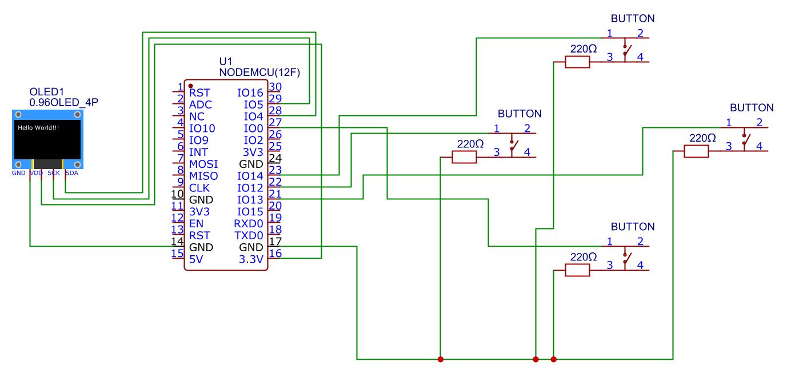

# ESP Game Console

This project is a simple game console running on an ESP8266 with an OLED display and buttons. It includes several games such as **Flappy Bird**, **Snake**, **Catch the Dot**, and **Dodge the Blocks**.

## Installation

1. **Hardware Setup:**  
   Connect your ESP8266 according to the schematic provided in the file `Schematic_esp-game-console.pdf`.
   

2. **Uploading Files:**  
   Upload the following two files to your ESP8266 using your preferred tool (e.g., Thonny, ampy, or WebREPL):
   - `ssd1306.py`
   - `main.py`

3. **Restart:**  
   Once the files are uploaded, restart your ESP8266.

## Console Controls

- **Main Menu:**  
  When the ESP8266 starts, a menu is displayed on the screen. Use the following buttons to navigate:
  - **Left Button:** Move the selection up.
  - **Right Button:** Move the selection down.
  - **Select (Up) Button:** Confirm your selection and launch the game.

- **In-Game Controls:**  
  Each game has its own control scheme:
  - **Flappy Bird:** Press the jump button to make the bird fly upward. The bird falls due to gravity.
  - **Snake:** Use the directional buttons to control the movement of the snake.
  - **Catch the Dot:** Use the left and right buttons to move the player's square and catch the falling dot.
  - **Dodge the Blocks:** Use the left and right buttons to move the player's square and avoid falling blocks.

After a game over, the console will display a "Game Over" screen before returning to the main menu.

## Images

The `img` directory contains screenshots and diagrams:
- `Catch the Dot.jpg`
- `Dodge the Blocks.jpg`
- `Flappy Bird.jpg`
- `game over.jpg`
- `menu.jpg`
- `physical layout.jpg`
- `Schematic_esp-game-console.jpg`
- `Snake.jpg`

## License

This project is open source. Feel free to modify and extend it as needed.

